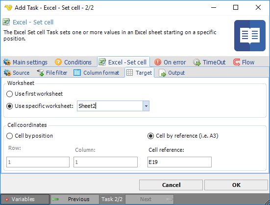

## Task Office - Excel - Set Cell

The Excel - Set cell Task sets one or more values in an Excel sheet starting on a specific position.
 
This task is similar to the Excel - Create Task. The difference is that this Task updates an existing document (or multiple documents).
 
The update is based on a Variable or direct value and the update starts in the cell position/reference and sheet that the user has specified. From that start point VisualCron will create a "table" based on content. The actual content could be a single cell but it can also be a table.
 
For example if the start position is 2,2 and the value is:

"col1row1,"col2row1"

"col1row12,"col2row2"

The output will be placed in 2,2 to 3,3:
 
**Excel - Set cell > Source** sub tab

**Input value**

The input value can either be hard coded string or Variable. It is important that input value matches format so that lines and columns are split in the  right way. Please note that if you need another format than Text format in excel you need to specify column format in "Column format "tab.
 
**Format**

You need to adjust format controls so they fit the format of the incoming value.  The text qualifier is any surrounding character.
 
**Excel - Set cell > File filter > Location** sub tab

If you have selected File as source you are able to set the standard VisualCron [File filter](job-tasks-file-filter) values.
 
**Excel - Set cell > Column format** sub tab

In the columns tab you can override column format. Default format is `@` which is a string. You can see different format options when editing or adding a column.
 
**Add->Format**

[http://www.ozgrid.com/Excel/CustomFormats.htm](http://www.ozgrid.com/Excel/CustomFormats.htm)
 
**Excel - Set cell > Target** sub tab

**Worksheet**

The worksheet to be updated.
 
**Cell coordinates**

The relative position the update should start at.
 
**Excel - Set cell > Output** sub tab

**Save to..**

You are able to control if the update should be saved to same file or different file.
 
**Credential**

If you are planning to save on a network location you can select a Credential.
 
**Password protection**

If you want to protect the file with Excel password authentication you can check this value and enter a password.
 
**Remove password when saving**

If you want to remove the password after execution you need to check this. You need to specify password for accessing the file the first time. After writing the "Use password.." option will be unchecked so that the Task does not try to open it with a password anymore.