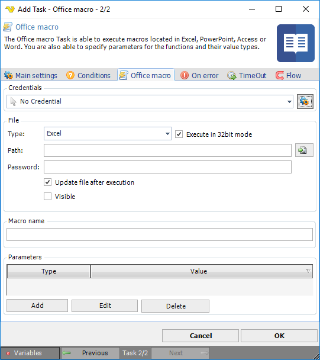
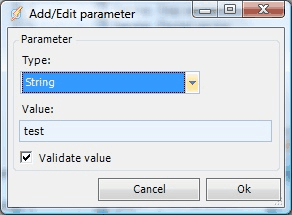
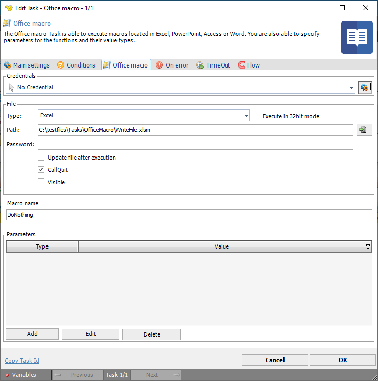
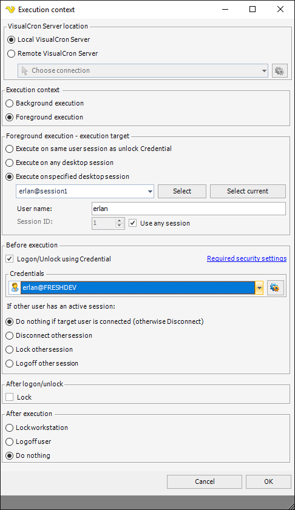

## Task Office - Office - Macro

The Office macro Task is able to execute macros located in Excel, PowerPoint, Access or Word. You are also able to specify parameters for the functions and their value types.



**Credentials**

You must specify a Credential, a remote server name, user name and pass word for a user on the remote server which the command will execute as. Click on the Manage credentials button to add a new Credential.
 
**File type**

Select either Excel, PowerPoint, Access or Word.
 
**Execute in 32 bit mode**

Set this to 32 bit if your Office is 32 bit - otherwise uncheck it.
 
**File path**

This is the full path to the document.
 
**Password**

Any password for accessing the document. Leave empty if no password is used.
 
**Update file after execution**

This saves the document after execution. Useful if you have performed a calculation on in the document.
 
**Parameters**

If a macro function needs parameters you can specify them here by clicking Add.



Choose appropriate *value type* and set the actual *value*. Normally VisualCron validates the value against the data type. If you use a Variable that validation can fail if the value is not set in the Variable. To prevent failure you can uncheck the *Validate value* checkbox.
 
### Errors
 
**Macro hangs / runs forever / is not doing what it is supposed to do**

The Excel macro Task is the most sensitive Task in VisualCron. This is because of two major things:

1. There is a dependency to a desktop tool Excel.exe while VisualCron is running as a service in the background
2. The actual execution is being done in the background - a hang usually means that Excel exe has aborted execution with an error - that we cannot see becuase it is not executed in the desktop.
 
But we could do some different tests:
 
To rule out some issues please test the following:

1. We have created a test macro that just writes a file "vba.txt" in c:\ root. You can download this file from here: [https://www.visualcron.com/files/support/WriteFile.zip](https://www.visualcron.com/files/support/WriteFile.zip). Unzip it to a local folder.
2. Create a new Job with new Office macro Task using these settings:



3. Save and try to run the Job. Check if file vbs.txt has been created in c:\ root
 
If the above does not work it might be something wrong in your system like a faulty Excel installation or permission limitations. If it works, but your macro still does not you need to add debugging to your macro. Easiest way is to use similar code as in the test macro to write to file. Add writing a line for each line in your code to determine which line does not work. Depending on which line it is different solutions could be done. You might need to set a [Credential](global-credentials) in the Task.
 
Possible reasons for error:

1. You have not set the right 32 or 64 bit flag (it is not matching currently installed Office Macro)
2. When testing, always test local first
3. Make sure you only use the macro name in Macro name field. No full path.
4. Use default settings with Visible flag unchecked
5. Make sure Credential is used correctly
 
Alternatively you can try using other Task types;
 
1. Execute Script Task - use this code:

*Code should be placed in a .vbs file*

```vb

Set objExcel = CreateObject("Excel.Application")
objExcel.Application.Run "'C:\Users\Ryan\Desktop\Sales.xlsm'!SalesModule.SalesTotal"
objExcel.DisplayAlerts = False
objExcel.Application.Quit
Set objExcel = Nothing

```

2. Execute Task. Use full path to Excel.exe in command line and full path to your macro file with the module and macro name included like this: `C:\Users\Ryan\Desktop\Sales.xlsm'!SalesModule.SalesTotal`
 
You might need to set a Credential in the Task.
 
3. Execute Task - with Foreground mode. Use same settings as 2  but without the Credential. Go to main settings of the Task - Execution context. Set it to something like this:



**System.Reflection.TargetInvocationException: Exception has been thrown by the target of an invocation. ---> System.Runtime.InteropServices.COMException (0x800A03EC): Microsoft Excel cannot access the file 'C:\your file.xlsm'.**

There are several possible reasons:
 
Solution

1. Create directory "`C:\Windows\SysWOW64\config\systemprofile\Desktop`" (for 64 bit Windows) or "`C:\Windows\System32\config\systemprofile\Desktop`" (for 32 bit Windows)
2. Set Full control permissions for directory Desktop (for user "SYSTEM")
 
Please do this for both 32 and 64 bit folder.
 
**System.Runtime.InteropServices.COMException (0x800A07D1): You canceled the previous operation.**

Try running the Task with a Credential that has option "Local logon" and "Load profile" checked.
 
 
**System.Runtime.InteropServices.COMException (0x800A03EC): Cannot run the macro Macro1'**.

The macro may not be available in this workbook or all macros may be disabled.
 
Open the document and find the list of macros. Use the full path to the macro, like: **MainModule.CalcSomething**
 
**Faulting application name: EXCEL.EXE**

```

Faulting application name: EXCEL.EXE, version: 15.0.4719.1000, time stamp: 0x552cf4af
Faulting module name: VBE7.DLL, version: 0.0.0.0, time stamp: 0x54d16140
Exception code: 0xc0000005
Fault offset: 0x00008c0e
Faulting process id: 0x2914
Faulting application start time: 0x01d0a28e5b929b88
Faulting application path: C:\Program Files\Microsoft Office 15\Root\Office15\EXCEL.EXE
Faulting module path: C:\Program Files (x86)\Common Files\Microsoft Shared\VBA\VBA7.1\VBE7.DLL
Report Id: 9a82692d-0e81-11e5-9bb4-989096a28d27

``` 
 
Solution 1 - Recompile the Project

1. Open the workbook in Excel. Normally Excel will disable macros in a worksheet until you click a button to enable the macros. Do not enable the macros just yet.
2. Open the VBA editor. You can hit ALT+F11 or on the ribbon click Developer > Visual Basic
3.  In the VBA editor double click your module or first module that contains your project. Add a commented line of code such as:
‘ This is a comment
Then click on the Debug menu at the top and click Compile VBA Project.
Repeat this step for each module in your workbook and then save the workbook.
4. Close the workbook and re-open it and enable the macros and test it.
 
Solution 2 - Disable Compile on Demand

In the VBE Editor in Excel, click on Tools > Options > General tab and click to uncheck “Compile on Demand”.
Alternatively you can set the following registry key:
`HKEY_CURRENT_USER\Software\Microsoft\VBA\7.0\Common`
Type:  DWORD
Name:  CompileOnDemand
Value:  0
 
**0x800706BA along with COMException**

System.Runtime.InteropServices.COMException (0x800706BE): The remote procedure call failed. (Exception from HRESULT: 0x800706BE)
 
Comment out any Quit command in your macro.