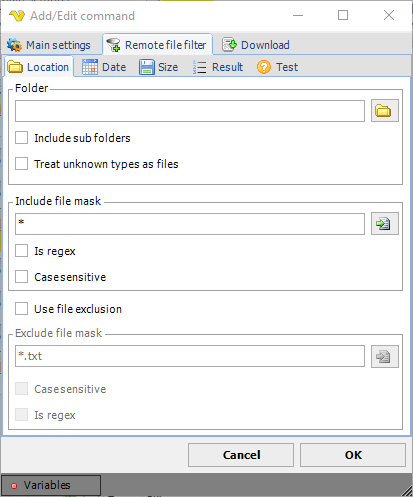
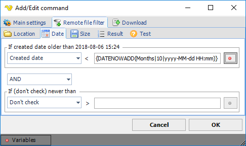
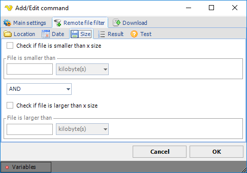
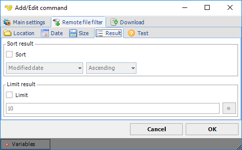

## Remote File Filter

The remote file filter is a limited version of the normal local [file filter](job-tasks-file-filter). The difference is that the remote file filter is limited for remote Tasks (like FTP/SFTP) and Triggers (Remote file).
 
### Evaluation

The file filter is evaluated the following way:

* Location AND Content AND Date AND Size AND Attributes = filtered files
* Date = Date older than AND/OR Date newer than
* Size = Size smaller than AND/OR Size larger than
 
**Remote file filter > Location** sub tab

This tab contains the basic properties of finding one or more files.



**Folder**

The folder path where the source file(s) reside. You can input several folders by separating with semicolon ";" like this:
```C:\Temp;C:\test```
 
**Include sub folders**

If the file filter should look for files in sub folders then check this option.
 
**Treat unknown types as files**

Some servers to not report the correct item type (file or folder) when listing items and instead reporting unknown type. When checking this property VisualCron will treat unknown types as files.
 
**Include file mask**

Defined your file mask for the file name here. When not using “Is regex” string here you can use the normal wildcard characters like * or ?. You can input more than one file mask by separating them with semicolon ";" like this:
```*.doc```;```*.txt```
 
**Is regex**

If the include file mask is a regular expression. For more information about regular expressions please look here: [http://www.regular-expressions.info/](http://www.regular-expressions.info/)
 
**Case sensitive**

If the file name search is case sensitive.
 
**Exclude file mask**

It is possible, the same way, to use a exclusion filter. When not using “Is regex” string here you can use the normal wildcard characters like * or ?.
 
**Is regex**

If the exclude file mask is a regular expression. For more information about regular expressions please look here: [http://www.regular-expressions.info/](http://www.regular-expressions.info/)
 
**Remote file filter > Date** sub tab

It is possible to check the created/modified date against a Variable value.



**Remote file filter > Size** sub tab

It is possible to filter out files based on size. Like the Date filter it can be combined with AND/OR and check can be done on *Larger than* or *Smaller than*.



**Remote file filter > Result** sub tab

The filtered files can be presented (in output) in different ways. It is possible to sort the result on various values like name, modified date, created date and size. You can also limit the number of rows returned to, for example, only list the top 3 files according to the current sorting.



**Sort**

It is possible to sort the result on various values like name, modified date, created date and size. If sort is unchecked the files will just be presented in the order they are discovered.
 
**Limit**

Check this if you want to limit the number of rows returned. It will be limited according to the number (which could be a Variable) and the current sorting.
 
**Remote file filter > Test** sub tab

In the Test tab you can test your current file filter - if it matches any existing files. The test will use the selected Credential. Click on *Show filtered files* to test filter.

