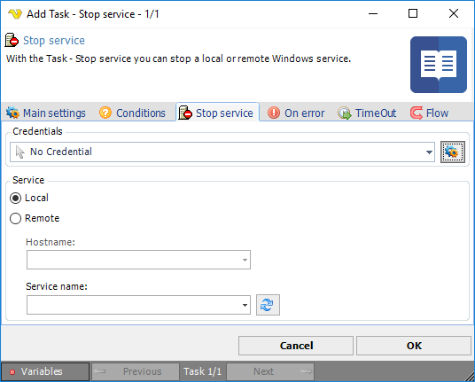

## Task Service - Stop Service

With the Task - Stop service you can stop a local or remote Windows service.

**Credentials**

To control a remote computer you may need to use a Credential. The Credential must match the user name and password of the user that you want to login for. Select a Credential in the combo box or click the *Settings* icon to open *Manage credentials* in order to add or edit Credentials.
 
*Local* or *Remote* Select the the Local radio button if you want to stop a service on the local computer, select the Remote radio button if you want to stop a service on a remote computer.
 
**Hostname**

The name of the remote computer.
 
**Service name**

The name of the service.