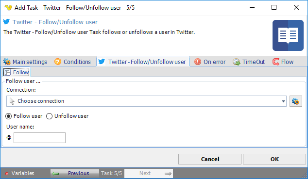

## Task Social - Twitter - Follow/Unfollow Tweet

The Social - Twitter Follow/Unfollow user Task follows or unfollows a user in Twitter.

**Connection**

To use Twitter Tasks you need to create a Connection first. You do that in the [Twitter Connection](connection-twitter) dialog.
 
**User name**

Twitter user to follow or unfollow.