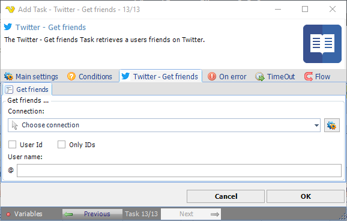

## Task Social - Twitter - Get Friends

The Twitter - Get friends Task retrieves a users friends on Twitter.

**Connection**

To use Twitter Tasks you need to create a Connection first. You do that in the [Twitter Connection](connection-twitter) dialog.
 
**User ID**

The screen name of the user for whom to return results for.
 
**Only IDs**

Returns only friends ID numbers.
 
**User name**

The screen name of the user for whom to return results for.
 
See Twitter Developer Documentation for detailed [GET friends](https://developer.twitter.com/en/docs/twitter-api/v1/accounts-and-users/follow-search-get-users/api-reference/get-friends-ids) information.