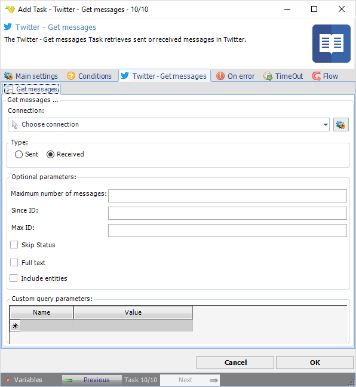

## Task Social - Twitter - Get Messages

The Twitter - Get messages Task retrieves sent or received messages in Twitter.

**Connection**

To use Twitter Tasks you need to create a Connection first. You do that in the [Twitter Connection](connection-twitter) dialog.
 
**Maximum number of messages**

Specifies the number of direct messages to try and retrieve, up to a maximum of 200.
 
**Since ID**

Returns results with an ID greater than (that is, more recent than) the specified ID.
 
**Max ID**

Returns results with an ID less than (that is, older than) or equal to the specified ID.
 
**Skip status**

When checked, statuses will not be included in the returned user objects.
 
**Include entities**

The entities node will not be included when not checked.
 
See Twitter Developer Documentation for detailed [GET messages](https://developer.twitter.com/en/docs/twitter-api/v1/direct-messages/sending-and-receiving/api-reference/get-event) information.