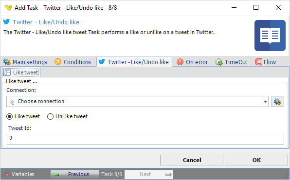

## Task Social - Twitter - Like/Undo Like

The Twitter - Like/Undo like tweet Task performs a like or unlike on a tweet in Twitter.

**Connection**

To use Twitter Tasks you need to create a Connection first. You do that in the [Twitter Connection](connection-twitter) dialog.
 
**UnLike tweet**

Removes a previous liked tweet.
 
**Tweet Id**

Number part in link to tweet.