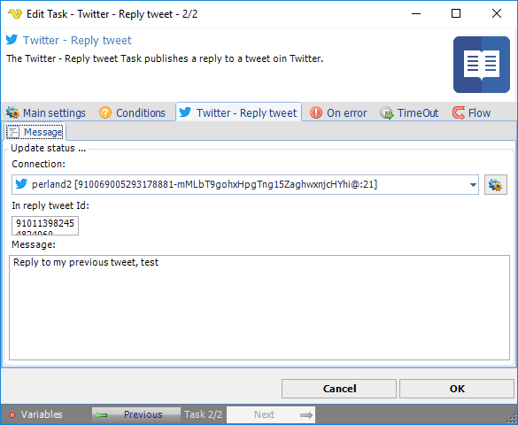

## Task Social - Twitter - Reply Tweet

The Twitter - Reply tweet Task publishes a reply to a tweet in Twitter.

**Connection**

To use Twitter Tasks you need to create a Connection first. You do that in the [Twitter Connection](connection-twitter) dialog.
 
**Id reply to tweet Id**

The tweet id to post a reply to
 
**Message**

The reply message to be sent