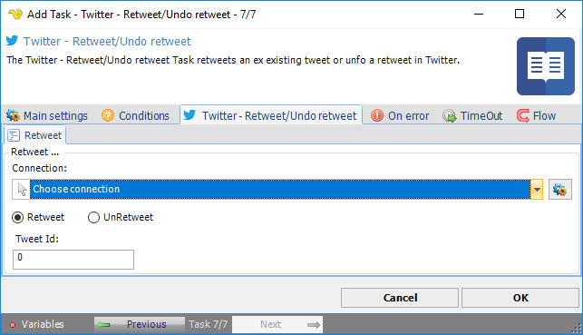

## Task Social - Twitter - Retweet/Undo Retweet

The Twitter - Retweet/Undo retweet Task retweets an existing tweet or undo a retweet in Twitter.

**Connection**

To use Twitter Tasks you need to create a Connection first. You do that in the [Twitter Connection](connection-twitter) dialog.
 
**Undo retweet**

Deletes a previous retweet by all Twitter account accounts following the used account.
 
**Tweet Id**

Number part in link to tweet.