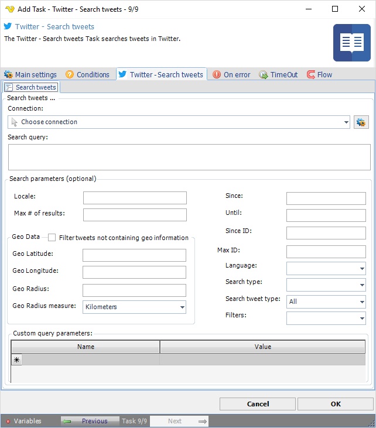

## Task Social - Twitter - Search Tweets

The Twitter - Search tweets Task searches tweets in Twitter.

**Connection**

To use Twitter Tasks you need to create a Connection first. You do that in the [Twitter Connection](connection-twitter) dialog.
 
**Search query**

A UTF-8, URL-encoded search query of 500 characters maximum, including operators. The only required search parameter.
 
**Locale**

Intended for language-specific consumers and the default should work in the majority of cases.
 
**Max # of results**

The number of tweets to return per page, up to a maximum of 100. Defaults to 15.
 
**Geo data**

Returns tweets by users located within a given radius of the given latitude/longitude.
 
**Until**

Returns tweets created before the given date. Date should be formatted as YYYY-MM-DD.
 
**Since ID**

Returns results with an ID greater than (that is, more recent than) the specified ID.
 
**Max ID**

Returns results with an ID less than (that is, older than) or equal to the specified ID.
 
**Language**

Returns tweets by language, given by an [ISO 639-1](https://en.wikipedia.org/wiki/List_of_ISO_639_language_codes) code.
 
**Geo data**

Returns tweets by users located within a given radius of the given latitude/longitude.
 
See Twitter Developer Documentation for detailed [GET search/tweets](https://developer.twitter.com/en/docs/api-reference-index) information.