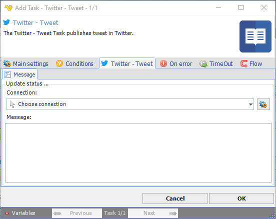

## Task Social - Twitter - Tweet

The Twitter - Tweet Task publishes tweet in Twitter.

**Connection**

To use Twitter Tasks you need to create a Connection first. You do that in the [Twitter Connection](connection-twitter) dialog.
 
**Message**

The tweet to be published.