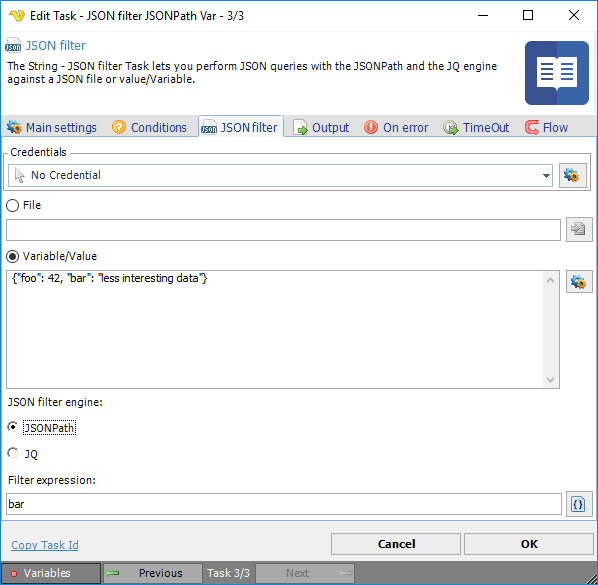

## Task String - JSON Filter

The String - JSON filter Task lets you perform JSON queries with the JSONPath and the JQ engine against a JSON file or value/Variable.
 
JQ filter manual: [https://stedolan.github.io/jq/manual/](https://stedolan.github.io/jq/manual/)

**Credentials**

To control a remote computer you may need to use a Credential. The Credential must match the user name and password of the user that you want to login for. Select a Credential in the combo box or click the Settings icon to open *Manage credentials* in order to add or edit Credentials.
 
**File**

Click the File radio button to enter a full file path to a JSON file. Click the *File* icon to browse for a JSON file.
 
**Variable/Value**

Enter Variable or value as input string. Click the *Settings* icon to to browse for Variables.
 
**JSON filter engine**

Select JSONPath or JQ program as a “filter”: it takes an input, and produces an output.
 
**Filter expression**

Enter the JSONPath or JQ filter expression. Click the *Filter expression* icon to browse the input stream structure.

