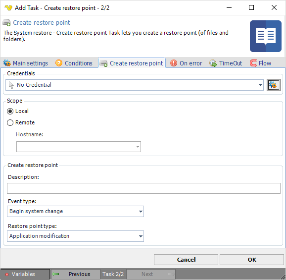

## Task System Restore - Create Restore Point

The System restore - Create restore point Task lets you create a restore point (of files and folders).
 
 

**Credentials**

To control a remote computer you may need to use a Credential. The Credential must match the user name and password of the user that you want to login for. Select a Credential in the combo box or click the **Settings** icon to open **Manage credentials** in order to add or edit Credentials.
 
**Local or Remote**

Select the the *Local* radio button if you want to control the local computer, select the *Remote* radio button if you want to control a remote computer.
 
**Hostname**

The name of the remote computer.
 
**Description**

Short description of the restore point.
 
**Event type**

Select applicable type of event related to system change.
 
**Restore point type**

Select applicable type of restore point related to application change.