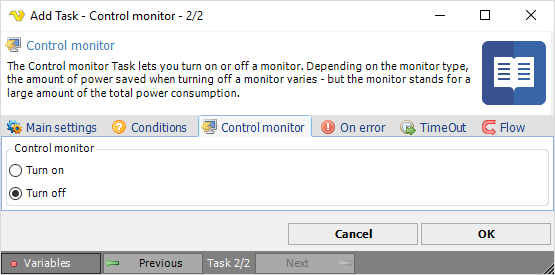

## Task System - Control Monitor

The Control monitor Task lets you turn on or off a monitor. Depending on the monitor type, the amount of power saved when turning off a monitor varies - but the monitor stands for a large amount of the total power consumption.
 
Some typical power consumption levels (watts) for computer equipment are:

* Desktop computer: 60W
* CRT (Cathode Ray Tube) monitor: 75W
* Flat screen monitor: 25W
* Laser jet printer: 7.2W

Select either Turn on or Turn off to control monitor power state.

