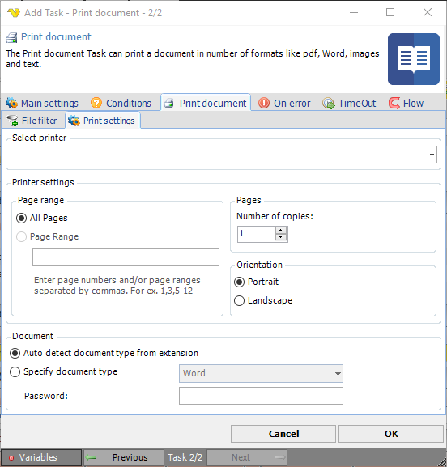

## Task System - Print Document

The Print document Task can print a document in number of formats like pdf, Word, images and text.
 
**Print document > File filter > Location** sub tab

In the File filter tab you define which file that should be printed. Read more about file filter [here](job-tasks-file-filter).
 
**Print document > Print settings** sub tab

**Select printer**

Select your desired printer here.
 
**Printer settings**

You can set some basic printer settings.
 
**Page range**

You can either print all pages of the document or select pages.
 
**Pages**

You can set the number of copies here.
 
**Orientation**

Select either portrait or landscape.
 
**Document**

Specify a path to the document you want to print.
 
**Auto detect document type from extension**

VisualCron tries to print the document from the extension name. It is important that the extension is correct otherwise you will get printing problems.
 
**Specify document type**

Instead of auto detecting, if you know the document type, you can specify it here.
 
:::info Note

Printing images requires that you have any version of Microsoft Office installed.

:::

### Troubleshooting

**I cannot see my printer**

This is probably a permissions problem. Please check the sharing permissions on the printer. By default, the user account that runs the VisualCron service is SYSTEM account and that user needs to have this printer shared to.
 
**Landscape mode is not working**

Try checking the option Use fallback mode.