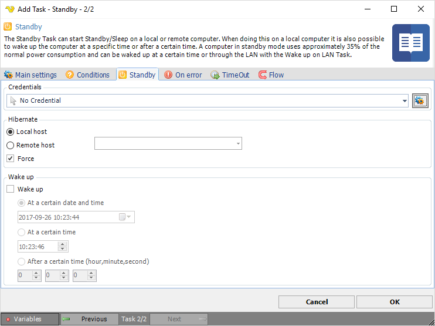

## Task System - Standby

The Standby Task can start Standby/Sleep on a local or remote computer. When doing this on a local computer it is also possible to wake up the computer at a specific time or after a certain time. A computer in standby mode uses approximately 35% of the normal power consumption and can be waked up at a certain time or through the LAN with the Wake up on LAN Task.
 
In Standby mode, your computer might appear to be turned off but it could automatically restart. So shut down your computer completely when it's not in use e.g. on an airplane. Standby is not appropriate for long term use, on many laptops, overnight is probably pushing it on standby. And it has one important limitation, everything is in memory not saved to the hard drive.

**Credentials**

To control a remote computer you may need to use a Credential. The Credential must match the user name and password of the user that you want to login for. Select a Credential in the combo box or click the *Settings* icon to open *Manage credentials* in order to add or edit Credentials.
 
**Local or Remote**

Select the the *Local server* radio button if you want to control the local computer, select the *Remote server* radio button if you want to control a remote computer.
 
**Hostname**

The name of the remote computer.
 
**Force**

Force suspend/standby = do not send permission request to applications.
 
**Wake up**

Turns on or off wake up.
 
**At a certain date and time**

Wakes up the computer at the specified year, month, day, hour, minute and second.
 
**At a certain time**

Wakes up the computer at the specified hour, minute and second.
 
**After a certain time**

Wakes up the computer after a certain time; hour, minute and second.

:::info Note

**Remark on Wake Up** 

Some computers can wake up from standby and not from hibernation, some work for both, and some for none. It all depends on the BIOS and the APM/ACPI capabilities, your motherboard, and your ATX power supply version.

:::