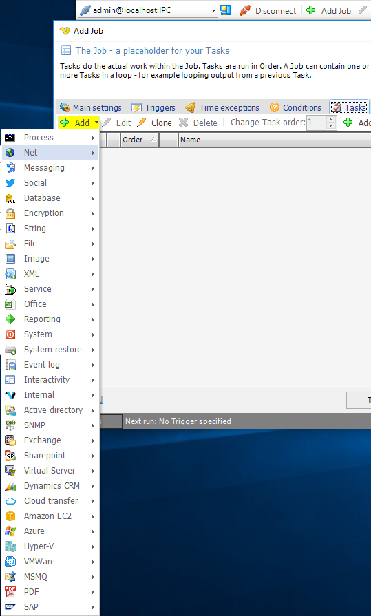
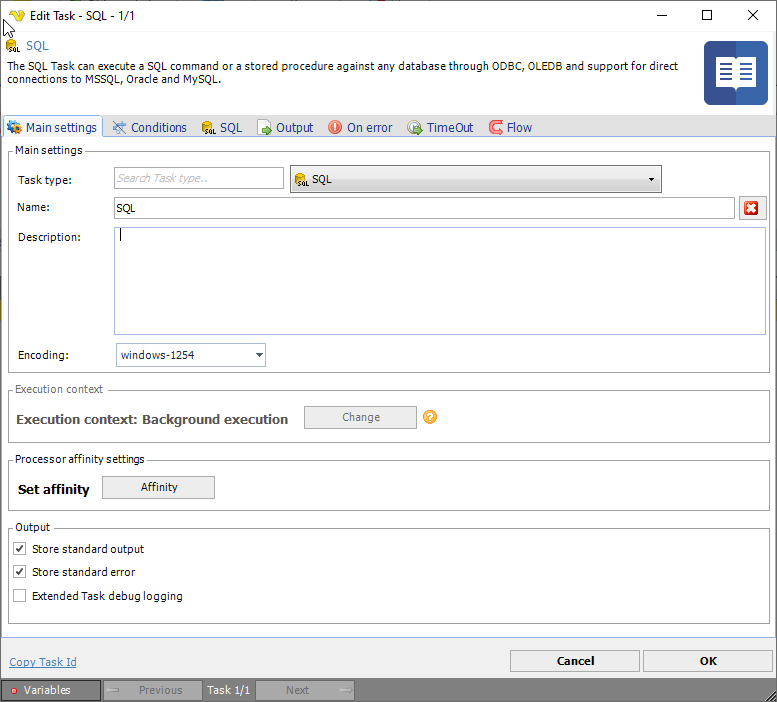
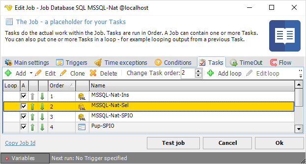

## Task - Main Settings

A set of different Task types can be defined using the **Add/Edit Job > Tasks** tab, then press the Add button to display the list of Tasks.
 
**Add Job > Tasks > Add** tab

After selecting a Task, in this case the **Internal > Set Job Variable**, the **Set Job Variable > Main Settings** tab is displayed. Also, the selected Task is preset as *Task type* but this may be changed.
 
**Set Job Variable > Main Settings** tab

:::tip Note 

If several Tasks are defined for a Job and the Tasks are under execution, the Task information fields will include just executed, present and previous information. In the Add/Edit Job > Tasks window, adjust the Change Task order in which the Tasks are executed.

::: 

**Encoding**

The encoding property sets which encoding to use. This feature is not implemented in all Tasks. If you got any encoding problem please contact support.
 
**Execution context**

Click the Change button to set [Execution context](executioncontext).
 
**Processor affinity settings**

This control if the CPU usage of a Task should be controlled automatically (divided over processors/cores) or if you want to execute on a specific processor/core.
 
**Stor stanard output/error**

By default, VisualCron is capturing and storing all output from executed processes. If you don't want this and want Windows to capture all output you uncheck these options.
 
**Extended Task debug logging**

Sometimes support of VisualCron asks you do check this to provide additional debug information for a problem. When checked, additional debug output will be added to standard output.
 
**Task order**

The task order can be changed by either clicking on the up/down arrows next to each Task or select a Task row and edit the Change Task order numeric field.
 
**Edit Job > Tasks** tab

**Loop**

Loops can be added to one or more Tasks, read more about [loops](loops) here.

