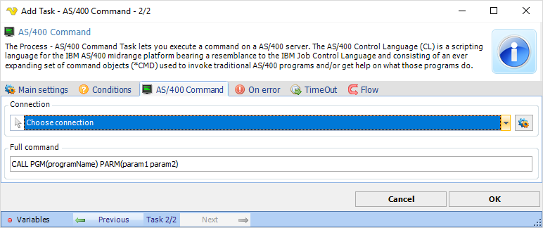

## Task Process - AS/400 Command

The Process - AS/400 Command Task lets you execute a command on a AS/400 server. The AS/400 Control Language (CL) is a scripting language for the AS/400 midrange platform bearing a resemble to the IBM Job Control Language and consisting of an ever expanding set of command objects (*CMD) used to invoke traditional AS/400 programs and/or get help on what these programs do.

**Connection**

Select a AS/400 Connection. You can set up the Connection here: [AS/400 Connection](../server/connection-as400).
 
**Full command**

Specify the command to call the program with any parameters according to the default format.
 
:::tip Note

The AS/400 Command Task requires that you install IBM Client Access (V5R3 or later) on the VisualCron Server.

:::