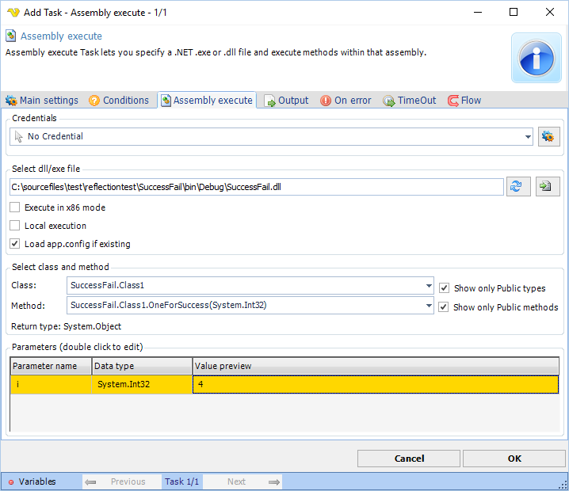
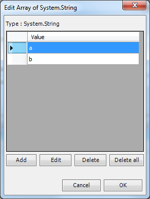

## Task Process - Assembly Execute

The Process - Assembly execute Task lets you specify a .NET .exe or .dll file and execute methods within that assembly. Select an assembly, class and method. Then double click on parameter rows to set values. Depending on the value type different input forms will be used.
 
**Output**

The Assembly execute will return a string representation of the result and will try to separate value by a comma if it is an array.

**Credentials**

To control a remote computer you may need to use a Credential. The Credential must match the user name and password of the user that you want to login for. Select a Credential in the combo box or click the Settings icon to open Manage credentials in order to add or edit Credentials.
 
**Select dll/exe file**

This is the full path to the assembly file. If you move this Task to another place you need to move the assembly file as well. The file selection button open the explorer to select the file. The Refresh button reloads the class/method information.
 
**Execute in x86 mode**

Executes the assembly in a x86 process.
 
**Local execution**

Hosts the assembly in VisualCron instead of external process. Should only be used for simple assemblies without dependencies. Please note that you need to restart the VisualCron service to reload any assembly into memory with this option checked.
 
**Load app.config if existing**

Tries to load the app.config of your dll if it exists.
 
**Class**

This is the name of the Class.
 
**Show only public types**

When selecting a file or clicking refresh class information is loaded from the assembly. By default, only public classes are loaded. If you want to load class with other modifiers/visibility you must uncheck this.
 
**Method**

When you change the Class all methods within that Class will be populated into the method combo box.
 
**Show only Public methods**

When selecting a file or clicking refresh method information is loaded from the assembly. By default, only public methods are loaded. If you want to load method with other modifiers/visibility you must uncheck this.
 
**Return type**

This label shows the return type of the selected method. This is the type that will be converted to a string in the Output of the Task.
 
**Parameters**

Double click on parameter rows to set values. Depending on the value type different input forms will be used.

