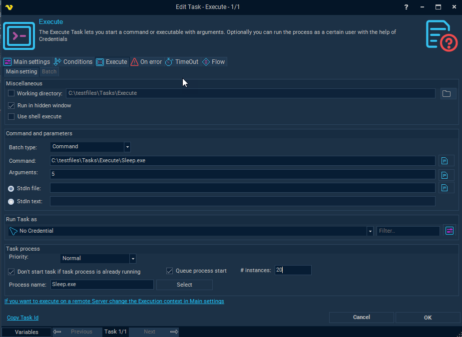
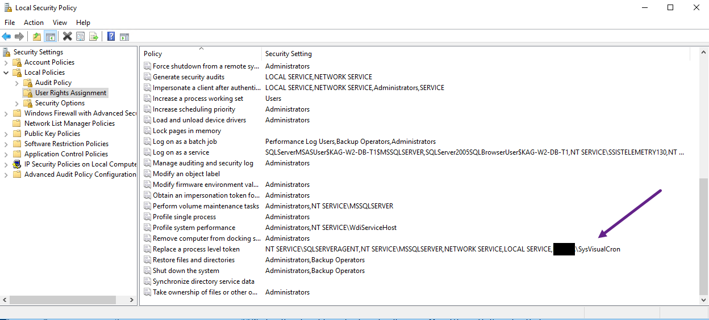
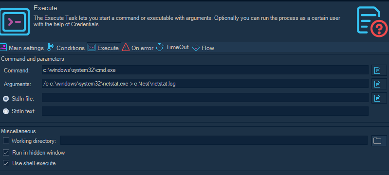

## Task Process - Execute

The Execute Task lets you start a command or executable with arguments. Optionally you can run the process as a certain user with the help of Credentials.



**Miscellaneous**
 
**Working directory**

This option may be used if you for example want to execute a PHP script which has no absolute links. Let say that the PHP script tries to write a file "test.txt". If you specify a working directory, you also specify where PHP will write the file. If not specified in this case, PHP will write the file where php.exe is stored, not where the script is stored (that is because the Working Directory by default will be where the command is located, in this case php.exe is the Task and the script is the argument).
 
**Run in hidden window**

When checked, VisualCron will run the Task in hidden mode which means that if a Task normally creates a window, this will not be displayed. If you want to hide a GUI application (winform) you must also check Use shell execute.
 
**Use shell execute**

False is unchecked and true refers to checked.
 
This setting concerns whether or not to use the operating system shell to start the process. Default is unchecked which means that the process is created directly from the executable file instead of (checked) use the shell when starting the process.
 
The *Working Directory* property behaves differently when *Use shell execute* is true than when *Use shell execute* is false. When *Use shell execute* is true, *Working Directory* specifies the location of the executable. If *Working Directory* is an empty string, the current directory is understood to contain the executable. When *Use shell execute* is false, the *Working Directory* property is not used to find the executable. Instead, it is used by the process that is launched and only has meaning within the context of the new process.
 
Setting this property to false enables you to redirect input, output, and error streams.
 
One reason to use shell execute is when you want to run a GUI application (winform) in hidden mode and not want output of the application. To make a winform application hidden you must use shell execute in combination with run in hidden window.
 
**Command and parameters**
 
**Batch type**

Command (default) - used for single command and arguments.
Batch - ability to create batch files inside the Batch tab of this Task. The advantages compared to external batch files are;

* VisualCron will store changes to batch files so you can track that
* You will be able to use VisualCron Variables in the batch script
* The batch script will, among the other objects in VisualCron, be part of backup
 
**Command**

This is the path to the executable - always enter full path and name to the executable file.
The rightmost button opens a file browser for selection. The only mandatory parameter in the Execute window.
 
**Arguments**

Arguments don't have to start with a space key, look at the Add Task view for an example. Use "" around long arguments.
 
**Run Task as**

This functionality currently only works for the Task type "Execute". Select appropriate Credentials in the select box. You can add new credentials by clicking on the Manage credentials button.
 
**Logon type**

Logon type has been moved and settings for logging in with profile or not is located in the Credential now.
 
:::tip Note about domain

If the user belongs to a domain you must specify that domain. If the computer is not connected to a domain you should use the exact computer name. This can be found when opening "My computer".

:::

:::tip Note about arguments/parameters:

Use "" around arguments.

:::

**Run with API code**

When using this option all processes as started through an API call of Win32 API.
This is the default option. Don't change this unless you get problems with Access Denied when opening Desktop in the log file.
 
**Run with managed code**

When using this option the all processes are started through the managed wrapper of the API. Don't change to this setting unless you get problems with Access Denied when opening Desktop in the log file.
 
**Process priority**

VisualCron Tasks can be run with any standard process priority. The following priorities are available:
* "Idle" - Indicates a process whose threads run only when the system is idle and is preempted by the threads of any process running in a higher priority class. An example is a screen saver. The idle priority class is inherited by child processes.
* "Below Normal" - Indicates a process that has priority higher than Idle but lower than Normal.
* "Normal" - Default value, indicates a normal process with no special scheduling needs.
* "Above Normal" - Indicates a process that has priority higher than Normal but lower than High.
* "High" - Indicates a process that performs time-critical Tasks that must be executed immediately for it to run correctly. The threads of a high-priority class process preempt the threads of normal or idle priority class processes. An example is the Task List, which must respond quickly when called by the user, regardless of the load on the operating system. Use extreme care when using the high-priority class, because a high-priority class CPU-bound application can use nearly all available cycles.
* "RealTime" - Indicates a process that has the highest possible priority. The threads of a real-time priority class process preempt the threads of all other processes, including operating system processes performing important Tasks. For example, a real-time process that executes for more than a very brief interval can cause disk caches not to flush or cause the mouse to be unresponsive.
 
**Don't start Task if Task process is already running**

If you want VisualCron to start a Task only if a process is NOT running, then check this box and enter the name of the process. The process name must be an existing process, for convenience use the "3-dots­button" and pick that process (ensure that it is running before you open the window).
 
**Queue process start**

If a Don't  start Task if process is alrady running is checked you can choose to queue the process (wait for it to complete before starting new). The # Instances value controls how many we allow before starting a new process. If value is 0 the current process need to finish. If value is 10 and we execute 30 times we will allow 10 first, then add one by one as the processes terminate.
 
**# instances**
See Queue process start.
 
**Kill process / Close main window**

Instead of adding two Tasks, one execute and one kill, you can specify the time the main window or process should be active. If you for example check the box and specify "Kill process" after "1 minute(s)", the Task will start and then terminated after exactly one minute. However, try "Close main window" instead of "Kill process". Killing the process is harder and may interrupt the process if it is trying to save anything on exit. Kill may also result in Task exit code -1. When trying to kill a hidden window you must use kill process.
 
### Notes about Troubleshooting:
 
**Error: The service cannot be started, either because it is disabled or because it has not enabled services associated with it**

Always use the full path to the file. Also, make sure that you split up command and argument. For example, if your command is normally:
```netsh DHCP server \\silvercreek dump```
 
Then use:
Command: ```c:\windows\system32\netsh.exe```
Argument: ```DHCP server \\servername dump```
 
**Error: You want do redirect output to file but it does not work or causes errors**

By default VisualCron captures all output. The advantages with that is that you can reuse the data in other Tasks. For example, in the body of an Email Task.
 
**Error: I get a UAC popup warning**

Set the Execute Task to run "Hidden". From Vista and forward, a process started by a background process (in this case a service), must not interact with desktop.
 
**Error: The process cannot be started because the file cannot be found**

A couple of reasons:
1. If there is a dependency between ENVIRONMENT Variables for a new runtime or anything like that then you have to restart the VisualCron service to reload those variables. You can verify ENVIRONMENT Variables by creating a batch file that just "```print %PATH%```". You will then see existing Variables in
2. Make sure you use the full path to the file.
3. Do not mix arguments and path to executable in command. Divide them - see first error.
 
**Error: Exit code -1073741502 / -1066598274**

There is a permissions problem, either on user level (the Credential you use) or the Local Security Policy settings on the server that prevents the SYSTEM account from running a process as another user. While the problem might be unknown there are some alternatives and workarounds:
 
Alternative 1
Make sure that the *serviceuser* account is a local administrator and member of the group ```BUILTIN/Administrators```.
 
Alternative 2
If you use 8.1.2 or later:
1. Turn on Extended debugging in Server settings.
2. Edit the Credential that you use
3. Change Execution options to Use Win32  API CreateProcessAsUser
 
Workaround 1
Turn of UAC in the Server settings in VisualCron window and reboot
 
**Error: Unhandled error when trying to start process:  A required privilege is not held by the client. (1314)  If the credential is removed, the job runs successfully.**

Go to Server settings->Log and uncheck "Extended debug logging". Edit the Credential you use and change to option "CreateProcessWithLogonW".
 
Please try any of the following:
1. turn off UAC and reboot from [Server settings](../server/main-settings)
2. Open Services->Find VisualCron and right click and select Properties. Uncheck "Allow service to interact with desktop". Restart the service.
3. Run the VisualCron service as SYSTEM account.
 
If this does not work you can change to Credential option "CreateProcessAsUserW" and then add the ```SE_ASSIGNPRIMARYTOKEN_NAME (SeAssignPrimaryTokenPrivilege)``` permission on the user that runs the VIsualCron service. You do this in the Local Security Policy:



**No output is captured**

Try unchecking Use shell execute.
 
**Redirecting output**

Pipe commands are implemented by cmd.exe. So you need to run ```cmd /c``` and add your executable path as argument.



