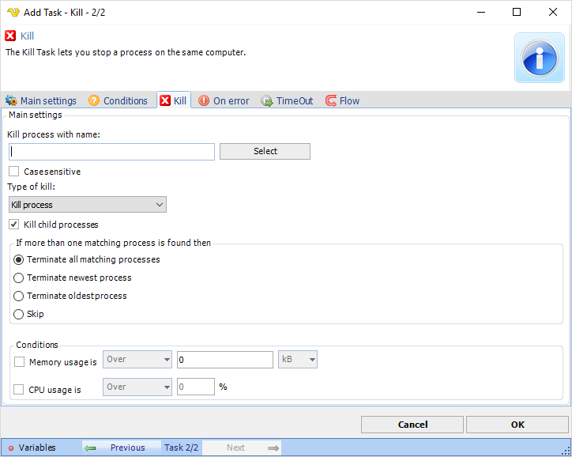

## Task Process - Kill

The Process - Kill Task lets you stop a process on the same computer.

**Process name**

Enter the name of the process, i.e. notepad.exe. If you want to be sure of the name then you can start the process on the server and the click on "Select" to show a list of all running processes.
 
**Case sensitive**

If the process name matching should be case sensitive or not.
 
**Type of kill** 
The kill functionality in VisualCron can be used to shut down a running application or process.

The **Type of kill** can be one of:
* Kill process
* Close main window
 
Closing the main window of the application is a nicer method because the application may need to save some settings before it is closed down. It will close down the main window like when an application is terminated by clicking in the top right corner.
 
Please note that the application will not shut down if there is a dialog box to confirm exit (i.e. "Are you sure you want to quit?"). If this is used try to disable the confirm dialog or, if it's not possible, use the "Kill process" method.
 
"Kill process" terminates all processes with the defined name directly. It is similar to open the Task manager and right click to select "End process".
 
**If more that one matching process is found**

If several process are running that matches the Process name you have several options:
 
**Terminate all matching processes**

Kills all matching processes.
 
**Terminate the newest process**

Kills only the process that was last started.
 
**Terminate the oldest process**

Kills only the process that was started first of all processes.
 
**Skip**

Do not kill any process.
 
**Conditions**

Limits for memory and CPU to be considered in kill process.