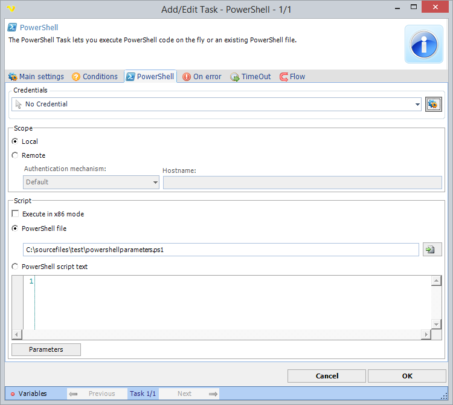

## Task Process - PowerShell

The **PowerShell** Task lets you execute PowerShell code on the fly or an existing PowerShell file.



**Credentials**

To control a remote computer you may need to use a Credential. The Credential must match the user name and password of the user that you want to login for. Select a Credential in the combo box or click the Settings icon to open Manage credentials in order to add or edit Credentials.
 
**Scope**

You can execute on the local machine or on a remote machine. To execute on a remote machine you need to combine settings with a Credential.
 
**Execute in x86 mode**

This settings is forcing 32 bit execution of your PowerShell script.
 
**PowerShell file**

Full path to a PowerShell script.
 
**PowerShell script text**

You enter your PowerShell code here which will be compiled and run in real time.
 
### Parameters

Click on Parameters button to edit parameters. You can parse parameters in the PowerShell script like this:

```powershell
param (
  [string]$parameterkeyname1 = "mydefaultvalue1",
  [string]$parameterkeyname2 = "mydefaultvalue2"
)
Write-Output $parameterkeyname1
```
 
About Script blocks
More information about script blocks here: [https://www.sapien.com/blog/2019/05/13/advanced-powershell-functions-begin-to-process-to-end/](https://www.sapien.com/blog/2019/05/13/advanced-powershell-functions-begin-to-process-to-end/)
 
### Starting script

In general you need to call the function after the script block. For example;

```powershell
Function Test-ScriptBlock
{
  // function content
} #END Function Test-ScriptBlock
 
// the function call
Test-ScriptBlock -Number 1
```

### Passing parameters
 
1. No parameters

```powershell
Function Test-ScriptBlock
{
    BEGIN
    {
        Write-Output "In Begin block"
    }
    PROCESS
    {
        Write-Output "In Process block"
    }
    END
    {
        Write-Output "In End block"
    }
} #END Function Test-ScriptBlock
 
Test-ScriptBlock
``` 

2. parameters after function call

```powershell
Function Test-ScriptBlock
{
    BEGIN
    {
        Write-Output "In Begin block"
    }
    PROCESS
    {
        Write-Output "In Begin block"
        Write-Output "Number value: "         $Number
    }
    END
    {
        Write-Output "In End block"
    }
} #END Function Test-ScriptBlock
 
 
Test-ScriptBlock -Number 1
```

3. Value parameters from pipeline

```powershell
Function Test-ScriptBlock
{
 Param
 ( 
     [Parameter(ValueFromPipeline)]
     [int]$Number
 )
    BEGIN
    {
        Write-Output "In Begin block"
    }
    PROCESS
    {
        Write-Output "In Begin block"
        Write-Output "Number value: "         $Number
    }
    END
    {
        Write-Output "In End block"
    }
} #END Function Test-ScriptBlock
 
 
1, 2, 3 | Test-ScriptBlock
``

4. Using VisualCron parameters into script block

```powershell
param (
  [int]$Number = 0
)
Function Test-ScriptBlock
{
    BEGIN
    {
        Write-Output "In Begin block"
    }
    PROCESS
    {
        Write-Output "In Begin block"
        Write-Output "Number value: "         $Number
    }
    END
    {
        Write-Output "In End block"
    }
} #END Function Test-ScriptBlock
 
 
Test-ScriptBlock -Number $Number
``` 
 

### Passing back data from PowerShell

You can use these PowerShell commands to pass back output to VisualCron:
 
**VisualCron standard output**

```powershell
write-output "my output"
``` 

**VisualCron standard error**

```powershell
write-error "my error"
```
 
**Raising/Throwing errors**

Use the Powershell throw command to raise errors. By default we are considering the Task fail if it contains any text written to error output. When that happens the standard output is overwritten with debug information. To override this behavior go to On error tab of Task and uncheck Contains error output.
 
### Troubleshooting

**Access denied errors**

Ensure PowerShell's ExecutionPolicy = Unrestricted
Start Windows PowerShell and type in the command below at the prompt and hit enter. It should return unrestricted.
get-executionpolicy
 
If it returns restricted then enter the command below at the prompt and hit enter. 
set-executionpolicy unrestricted
 
If you receive an Access Denied message, then open a ticket with your IT Team to update this for you. You may need to provide the steps below to them:
Update the Registry Editor (HKEY_LOCAL_MACHINE\SOFTWARE\Microsoft\PowerShell\1\ShellIds\Microsoft.PowerShell) with a tag for ExecutionPolicy and set it to Unrestricted 
 
**System.TypeLoadException**

If the ExecutionPolicy is setup correct and VisualCron returns the error below when running PowerShell, ask INFRA to upgrade PowerShell to the highest version available for the respective server. Recently we found that PowerShell v1 on a Windows 2008 SP2 servers will not execute PowerShell from VisualCron so we had to upgrade to PowerShell v2. 
 
**AuthorizationManager check failed**

Please add/insert the share you are trying to access in the script to "trusted sites".
 
**No output using Write-Host**

Write-Host cannot be used in the VisualCron enviroment which is different from Powershell.exe. You need to use Write-Output or Write-Error instead.
 
**Unhandled Exception: System.IO.FileNotFoundException: Could not load file or assembly 'System.Management.Automation, Version=3.0.0.0**

You need to install PowerShell 3.0. You can download it here: [https://www.microsoft.com/en-us/download/details.aspx?id=34595](https://www.microsoft.com/en-us/download/details.aspx?id=34595)
 
**How can I use PowerShell 7?**

Currently you cannot use it in the PowerShell Task as PowerShell 7 is using .NET Core 3.1 and VisualCron is using .NET Standard 4.8. We might upgrade in the future to .NET Core and then it would be possible. A workaround is to use the Execute Task with the PowerShell 7 exe (pwsh.exe) full path in command field and the full path to PowerShell script in argument field.
 
**CmdletBinding - no processing of PROCESS block**

Wrap the script into a fucntion (see example 1).
 
**PowerShell Task hangs**

If you are using dbatools in the command:
 
These links tell about the problem:
 
[https://dba.stackexchange.com/questions/184327/sql-agent-powershell-task-never-finishes](https://dba.stackexchange.com/questions/184327/sql-agent-powershell-task-never-finishes)
[http://glenn-pepper.co.uk/2018/11/22/2-issues-with-powershell-steps-in-sql-agent/](http://glenn-pepper.co.uk/2018/11/22/2-issues-with-powershell-steps-in-sql-agent/)
 
You can try one of the solutions;
 
* Use ```[System.Environment]::Exit(1)``` as last line (you can choose in VC to not raise error on this specific error)
* Use SQLCMD like [https://docs.microsoft.com/en-us/powershell/module/sqlserver/invoke-sqlcmd?view=sqlserver-ps](https://docs.microsoft.com/en-us/powershell/module/sqlserver/invoke-sqlcmd?view=sqlserver-ps)
* Use another method
