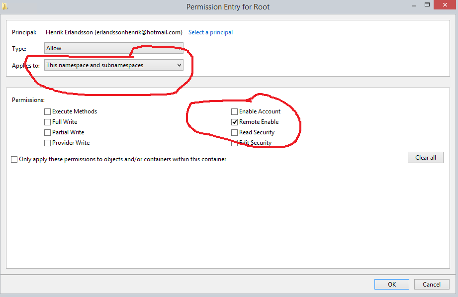

## Task Process - Remote Execute

This Task type can execute commands on a remote server. If you want to execute commands locally you should use the Execute Task.
 
 
**Limitations**

The Remote execute Task some limitations (limited by Windows API). In some scenarios this Task does not work well and ordinary Execute Task is recommend. Here are the limitations:
 
* Remote Execute Task cannot run as another user. The Credential selected is being used to connect to remote computer. When connected it will run as a system account on the remote server.
* Remote Execute Task cannot capture standard or error output.
* Remote Execute Task will always run hidden which means that UI interactions will not work.


**Credentials**

To control a remote computer you may need to use a Credential. The Credential must match the user name and password of the user that you want to login for. Select a Credential in the combo box or click the Settings icon to open Manage credentials in order to add or edit Credentials.
 
**Command**

Enter full path and name to the executable file. The rightmost button opens a file browser for selection. The only mandatory parameter in the Execute window.
 
**Arguments**

Arguments don't have to start with a space key, look at the Add Task view for an example. Use "" around long arguments.
 
**Working directory**

This option may be used if you for example want to execute a PHP script which has no absolute links. Let say that the PHP script tries to write a file "test.txt". If you specify a working directory, you also specify where PHP will write the file. If not specified in this case, PHP will write the file where php.exe is stored, not where the script is stored (that is because the Working Directory by default will be where the command is located, in this case php.exe is the Task and the script is the argument).
 
**Run in hidden window**

When checked, VisualCron will run the Task in hidden mode which means that if a Task normally creates a window, this will not be displayed. If you want to hide a GUI application (winform) you must also check Use shell execute.
 
:::tip Note about arguments/parameters:

Use "" around arguments.

:::

**Process priority**

VisualCron Tasks can be run with any standard process priority. The following priorities are available:
* Idle - Indicates a process whose threads run only when the system is idle and is preempted by the threads of any process running in a higher priority class. An example is a screen saver. The idle priority class is inherited by child processes
* Below Normal - Indicates a process that has priority higher than Idle but lower than Normal
* Normal - Default value, indicates a normal process with no special scheduling needs
* Above Normal - Indicates a process that has priority higher than Normal but lower than High
* High - Indicates a process that performs time-critical Tasks that must be executed immediately for it to run correctly. The threads of a high-priority class process preempt the threads of normal or idle priority class processes. An example is the Task List, which must respond quickly when called by the user, regardless of the load on the operating system. Use extreme care when using the high-priority class, because a high-priority class CPU-bound application can use nearly all available cycles.
* RealTime - Indicates a process that has the highest possible priority. The threads of a real-time priority class process preempt the threads of all other processes, including operating system processes performing important Tasks. For example, a real-time process that executes for more than a very brief interval can cause disk caches not to flush or cause the mouse to be unresponsive.
 
:::tip Note about Return codes:

Successful completion (0)
Access denied (2)
Insufficient privilege (3)
Unknown failure (8)
Path not found (9)
Invalid parameter (21)
Other (22–4294967295)

::: 

:::tip Note about Security settings:
These are the settings needed for a user account in Computer Management->WMI Control->Properties->Security tab->Select user and click Advanced:

:::



**Firewall settings on remote host**

1. Run: ```netsh advfirewall firewall add rule name="WinRM-HTTP" dir=in localport=5985 protocol=TCP action=allow```
2. Run ```winrm quickconfig``` and answered y on the activate question
 
*Other security settings on **remote** host*
 
Step 1. DCOM permission
1.    Open Dcomcnfg
2.    Expand Component Service -> Computers -> My computer
3.    Go to the properties of My Computer
4.    Select the COM Security Tab
5.    Click on "Edit Limits" under Access Permissions, and ensure "Everyone" user group has "Local Access" and "Remote Access" permission.
6.    Click on the "Edit Limit" for the launch and activation permissions, and ensure "Everyone" user group has "Local Activation" and "Local Launch" permission.
7.    Highlight "DCOM Config" node, and right click "Windows Management and Instruments", and click Properties.
8.    ```<Please add the steps to check Launch and Activation Permissions, Access Permissions, Configuration Permissions based on the default of Windows Server 2008>```
 
Step 2. Permission for the user to the WMI namespace
1.    Open WMImgmt.msc
2.    Go to the Properties of WMI Control
3.    Go to the Security Tab
4.    Select "Root" and open "Security"
5.    Ensure "Authenticated Users" has "Execute Methods", "Provider Right" and "Enable Account" right; ensure Administrators has all permission.
 
Step 3. Verify WMI Impersonation Rights
 
1.    Click Start, click Run, type gpedit.msc, and then click OK.
2.    Under Local Computer Policy, expand Computer Configuration, and then expand Windows Settings.
3.    Expand Security Settings, expand Local Policies, and then click User Rights Assignment.
4.    Verify that the SERVICE account is specifically granted Impersonate a client after authentication rights.
 
:::tip Note about Verifying security settings:
Run WBEMTest from local computer. Put domain, username and password and connect to remote machine.
[https://technet.microsoft.com/en-us/library/cc180684.aspx?f=255&MSPPError=-2147217396](https://technet.microsoft.com/en-us/library/cc180684.aspx?f=255&MSPPError=-2147217396)
 
:::

**More information about ports**

[https://support.microsoft.com/en-us/help/832017/service-overview-and-network-port-requirements-for-windows#method39](https://support.microsoft.com/en-us/help/832017/service-overview-and-network-port-requirements-for-windows#method39)