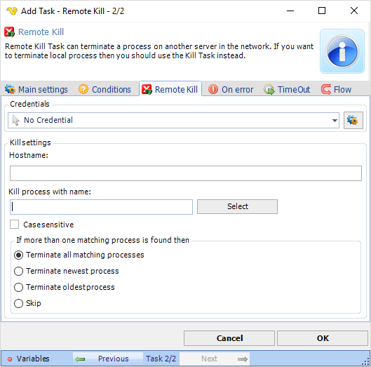

## Task Process - Remote Kill

The Process - Remote Kill Task can terminate a process on another server in the network. If you want to terminate local process then you should use the Kill Task instead.

**Credentials**

To control a remote computer you may need to use a Credential. The Credential must match the user name and password of the user that you want to login for. Select a Credential in the combo box or click the Settings icon to open Manage credentials in order to add or edit Credentials.
 
**Process name**

Enter the name of the process, like notepad.exe. If you want to be sure of the name then you can start the process on the server and the click on "Select" to show a list of all running processes.
 
**Case sensitive**

If the process name matching should be case sensitive or not.
 
**If more that one matching process is found**

If several process are running that matches the Process name you have several options:
 
**Terminate all matching processes**

Kills all matching processes.
 
**Terminate the newest process**

Kills only the process that was last started.
 
**Terminate the oldest process**

Kills only the process that was started first of all processes.
 
**Skip**

Do not kill any process.