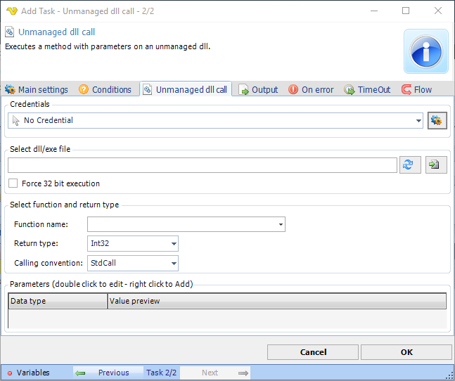

## Task Process - Unmanaged dll Call

Executes a method with parameters on an unmanaged dll.

**Credentials**

To control a remote computer you may need to use a Credential. The Credential must match the user name and password of the user that you want to login for. Select a Credential in the combo box or click the Settings icon to open Manage credentials in order to add or edit Credentials.
 
**Select dll/exe file**

This is the full path to the assembly file. If you move this Task to another place you need to move the assembly file as well. The file selection button open the explorer to select the file.
 
**Force 32-bit execution**

Check this if you want your dll to execute in 32 bit mode. Otherwise it will be default of the system (most likely 64 bit).
 
**Function name**

Type the name of a public function.
 
**Return type**

Select return type of the method.
 
**Calling convention**

Set the type of calling convention.
 
**Parameters**

If the selected method contains any parameter can double click on the row to add your own parameter value. Click right click to add