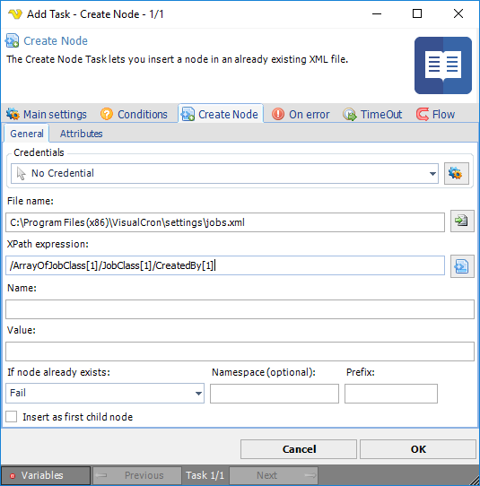
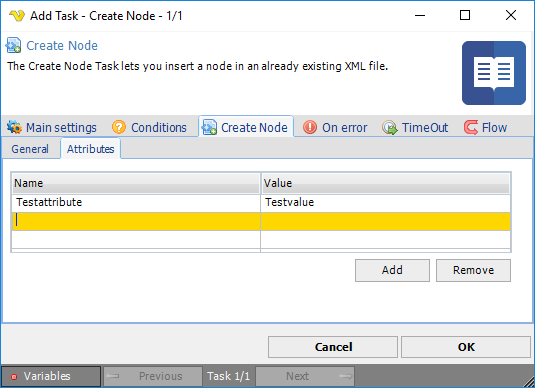

## Task XML - Create Node

The Create Node Task lets you insert a node in an already existing XML file.

**Credentials**

To control a remote computer you may need to use a Credential. The Credential must match the user name and password of the user that you want to login for. Select a Credential in the combo box or click the *Settings* icon to open *Manage credentials* in order to add or edit Credentials.
 
**File name**

The full path to the XML file.
 
**XPath expression**

XPath is a query language used for finding a specific object within XML. Enter the query manually or use the XPath browser by clicking the button.
 
**Name**

The name of the node.
 
**Value**

The value in the node.
 
**If node already exists**

You are able to control what happens if the node already exists in the document.
 
**Namespace**

If the node is in a specific namespace you enter the name here.
 
**Prefix**

If a prefix is needed for finding the node then enter it here.
 
**Insert as first child node**

If one or more nodes already exist the new node will, by default, be added in the end of the list. If you want it to appear in the beginning then check this check box.
 
**Create Node > Attributes** tab

If you want to add attributes to the specific node you can enter name and value in the **Attributes** sub tab.

