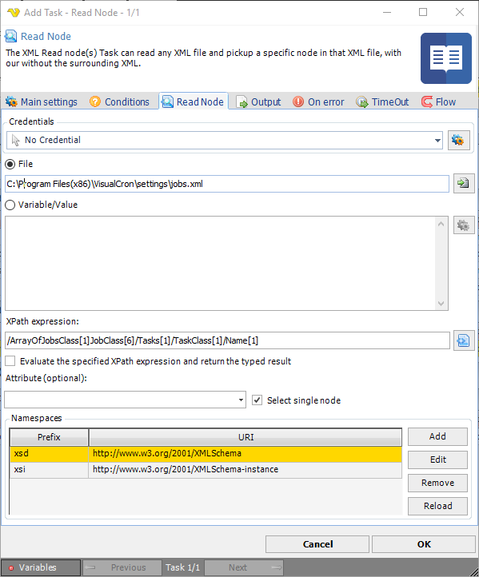
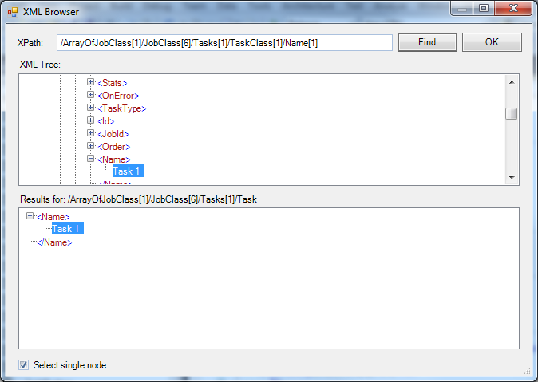
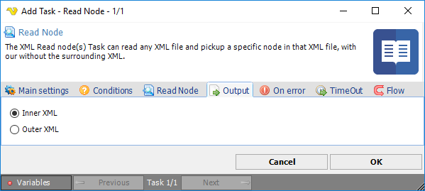

## Task XML - Read Node

The XML Read node(s) Task can read any XML file and pickup a specific node in that XML file, with our without the surrounding XML.



**Credentials**

To control a remote computer you may need to use a Credential. The Credential must match the user name and password of the user that you want to login for. Select a Credential in the combo box or click the *Settings* icon to open *Manage credentials* in order to add or edit Credentials.
 
**Source->File**

Enter the full path to the file you want to read from.
 
**Source->Variable/Value**

Paste any XML code or Variable that contains XML here.
 
**XPath expression**

XPath is a query language used for finding a specific object within XML. Enter the query manually or use the XPath browser by clicking the button.
 
**Attribute**

Optional. If you want to select a specific Attribute value of that node you can enter the attribute name here.
 
**Select single node**

If one or modes should be selected for output
 
**Namespaces**

VisualCron tries to load all namespaces that a XML file contains. If you want to Add one namespace manually you can click on Add. If you want to Reload all namespaces you can click on Reload.
 
**XPath selection**



The XML Browser lets you select a specific node in your XML file. When selected, you will have an XPath value which will be used during runtime of the Task. Click OK to save the path.

**Output** tab



In the output control how the output should look like. If you select Inner XML it will skip the parent XML tags while Outer XML will keep them.
 
:::info Note

If you are having problems retrieving a result it could be that you need to reference the namespace in the XPath query. For example:

```xml 

XML
<?xml version="1.0" encoding="UTF-8"?><jobInfo
  xmlns="http://www.force.com/2009/06/asyncapi/dataload">
<id>750f00000000Fw5AAE</id>
XPath
 
/x:jobInfo[1]/x:id[1]

```

:::