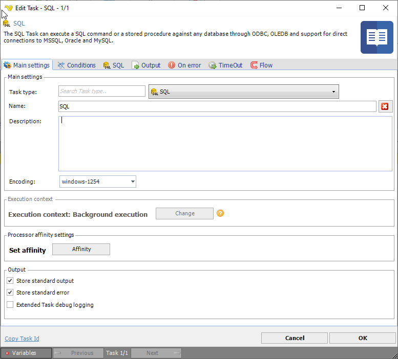

## Job - Tasks

A Task for a Job is managed either by mouse right-click on a Job (in the Server/Job/Task grid) and select _Add Task_ to Job ```'<Job name>'``` or by right-click on an existing Task and select _Edit Task_ ```'<Task name>'```.



The above is an example of the Task > Main settings window.
 
For each Job, one or more Tasks must be defined.
 
By default, a defined Job or Task is set to the "Active" state, but it is possible to inactivate each Job or Task individually, see [Activate/Inactivate Job](../server-group-job-task-area/job-list/activate-deactivate-job) for more information.
