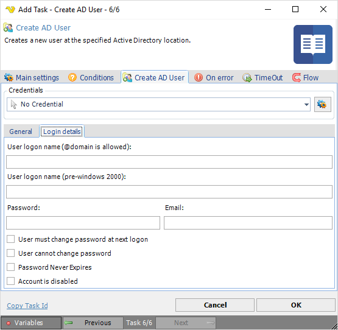

## Task Active Directory - Create AD User

Creates a new user at the specified Active Directory location.
 
**Create AD User > General** sub tab

**Credentials**

To control a remote computer you may need to use a Credential. The Credential must match the user name and password of the user that you want to login for. Select a Credential in the combo box or click the *Settings* icon to open *Manage credentials* in order to add or edit Credentials.
 
**Parent path**

The Lightweight Directory Access Protocol (LDAP) path of the parent Active Directory container. This is usually the top most container or the root of the directory data tree on a directory server. Click the *Select container* button to select an existing Active Directory container.
 
**First/Initials/Middle/Last name**

The user's different name parts.
 
**Full name**

First, Middle/Initial and Last Name parameters combined.

**User logon name (@domain is allowed)**

The logon name of the Active Directory user to be created.
 
**User logon name (pre-Windows 2000)**

The Pre-Windows 2000 logon name of the Active Directory user to be created. This defaults to the data entered in the User Logon Name property minus the @domain parameter (if applicable).
 
**Password**

The logon password of the Active Directory user to be created.
 
**E-mail**

The e-mail address of the Active Directory user to be created.
 
**User must change password at next logon**

If checked the user must modify the assigned password at next logon.
 
**User cannot change password**

If checked the user cannot change the assigned password. Only applicable only if the *User must change password at next logon* parameter is unchecked.
 
**Password never expires**

If checked the assigned password never expires.
 
**Account is disabled**

If checked the account to be created is in a disabled state.