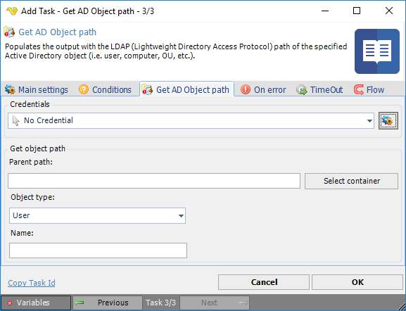

## Task Active Directory - Get AD Object Path

Populates the output with the LDAP (Lightweight Directory Access Protocol) path of the specified Active Directory object (i.e. user, computer, OU, etc.).

**Credentials**

To control a remote computer you may need to use a Credential. The Credential must match the user name and password of the user that you want to login for. Select a Credential in the combo box or click the *Settings* icon to open *Manage credentials* in order to add or edit Credentials.
 
**Parent path**

The Lightweight Directory Access Protocol (LDAP) path of the parent Active Directory container. This is usually the top most container or the root of the directory data tree on a directory server. Click the *Select container* button to select an existing Active Directory container.
 
**Object type**

The Active Directory object type in which to retrieve the path from. The options are: User, Computer, Group, Organizational unit and Printer.
 
**Name**

The name of an existing variable to be populated with the first object's LDAP path found in the Active Directory matching the name.