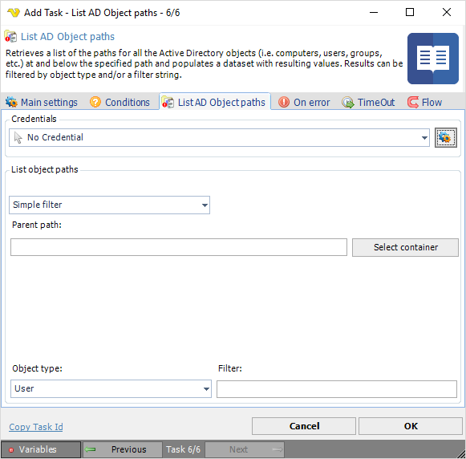

## Task Active Directory - List AD Object Paths

Retrieves a list of the paths for all the Active Directory objects (i.e.computers, users, groups, etc.) at and below the specified path and populates a data set with resulting values. Results can be filtered by object type and/or a filter string.

**Credentials**

To control a remote computer you may need to use a Credential. The Credential must match the user name and password of the user that you want to login for. Select a Credential in the combo box or click the *Settings* icon to open *Manage credentials* in order to add or edit Credentials.
 
**Filter options**

How to retrieve the Active Directory object's LDAP paths. Options are: Simple filter, Custom filter and ADO Query (SQL or LDAP syntax)
 
**Parent path**

The Lightweight Directory Access Protocol (LDAP) path of the parent Active Directory container. This is usually the top most container or the root of the directory data tree on a directory server. Click the *Select container* button to select an existing Active Directory container.
 
**Object type**

The Active Directory object type in which to retrieve the path from. The options are: User, Computer, Group, Organizational unit and Printer.
 
**Filter**

Provides a filter string to search for specific Active Directory objects.