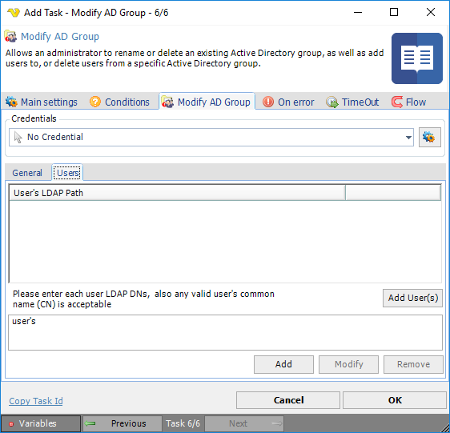

## Task Active Directory - Modify AD Group

Allows an administrator to rename or delete an existing Active Directory group, as well as add users to, or delete users from  a specific Active Directory group.
 
**Modify AD Group > General** tab

**Credentials**

To control a remote computer you may need to use a Credential. The Credential must match the user name and password of the user that you want to login for. Select a Credential in the combo box or click the *Settings* icon to open *Manage credentials* in order to add or edit Credentials.
 
**Path**

The LDAP path of the Active Directory group to modify. Click *Select Group* to select an existing group.
 
**Action**

The action to perform on the Active Directory group. The options are: Add user, Remove user, Rename group and Delete group.
 
**Modify AD Group > Users** tab

**Add User's**

Click the *Add User(s)* button and enter the property name of the Active Directory object (i.e. CN, CommonName, DN, DistinguishedName, etc.).
 
 
### Troubleshooting
 
**Error 0x80072035**

Error 0x80072035 usually returns due to a password policy. This can be length, special characters, password history (password was used before). It would help to handle those errors to prrovide feedback to the user. A guide to handle these errors can be found here:
[http://www.ozkary.com/2015/03/active-directory-setpassword-or.html](http://www.ozkary.com/2015/03/active-directory-setpassword-or.html)