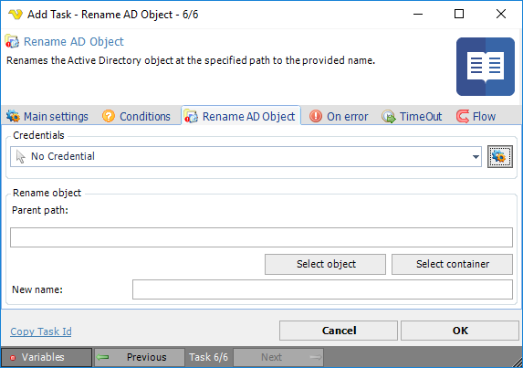

## Task Active Directory - Rename AD Object

Renames the Active Directory object at the specified path to the provided name.

**Credentials**

To control a remote computer you may need to use a Credential. The Credential must match the user name and password of the user that you want to login for. Select a Credential in the combo box or click the *Settings* icon to open *Manage credentials* in order to add or edit Credentials.
 
**Parent path**

The Lightweight Directory Access Protocol (LDAP) path of the parent Active Directory container. This is usually the top most container or the root of the directory data tree on a directory server. Click the *Select object* button to select an existing Active Directory object. Click the *Select container* button to select an existing Active Directory container.
 
**New name**

The desired new name of the Active Directory object.