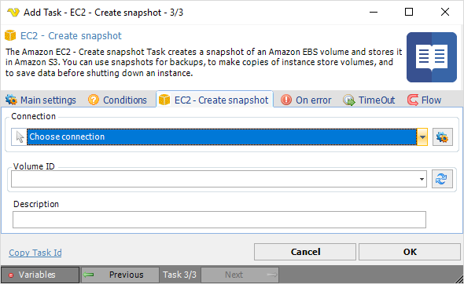

## Task Amazon EC2 - Create Snapshot

The Amazon EC2 - Create snapshot Task creates a snapshot of an Amazon EBS volume and stores it in Amazon S3. You can use snapshots for backups, to make copies of instance store volumes and to save data before shutting down an instance.

**Connection**

To use Amazon EC2 Tasks you need to create a [Connection](../../global-connections) first. Click the *Settings* icon to open the *Manage Connections* dialog.
 
**Volume ID**

The volume ID of the Amazon EBS volume.
 
**Description**

Descriptive text for the snapshot.