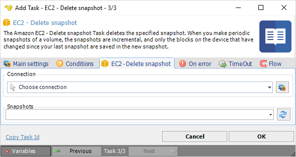

## Task Amazon EC2 - Delete Snapshot

The Amazon EC2 - Delete snapshot Task deletes the specified snapshot. When you make periodic snapshots of a volume, the snapshots are incremental and only the blocks on the device that have been changed since your last snapshot are saved in the new snapshot.

**Connection**

To use Amazon EC2 Tasks you need to create a [Connection](../../global-connections) first. Click the *Settings* icon to open the *Manage Connections* dialog.
 
**Snapshots**

The snapshot to be deleted. Click the *Refresh* icon to populate the drop-down snapshot list.