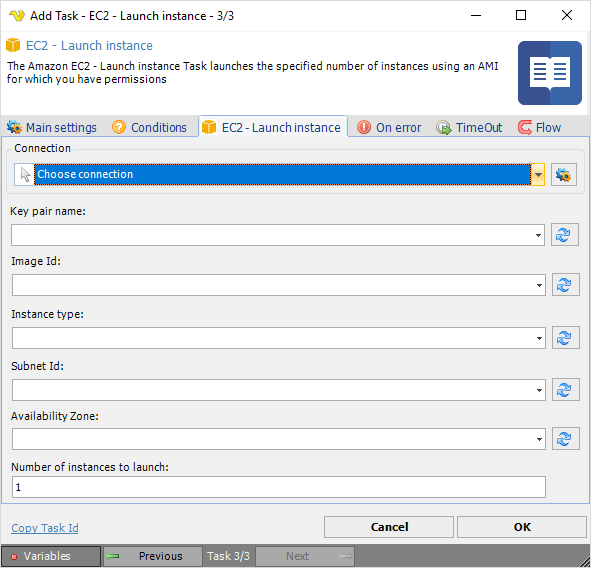

## Task Amazon EC2 - Launch Instance

The Amazon EC2 - Launch instance Task launches the specified number of instances using an AMI for which you have permissions.

**Connection**

To use Amazon EC2 Tasks you need to create a [Connection](../../global-connections) first. Click the *Settings* icon to open the *Manage Connections* dialog.
 
**Key pair name**

The name of the key pair (Example: -k websvr-keypair). Click the *Refresh* icon to populate the drop-down Key pair name list.
 
**Image Id**

The unique ID of a machine image. Click the *Refresh* icon to populate the drop-down Image ID list.
 
**Instance type**

The size of the instance to launch. Click the *Refresh* icon to populate the drop-down Instance type list.
 
**Subnet Id**

Specify the CIDR block for the subnet (a subset of the VPC CIDR block) in the Avalability Zone. Click the *Refresh* icon to populate the drop-down Subnet ID list.
 
**Availability Zone**

The zone in which to launch the instance(s). Click the *Refresh* icon to populate the drop-down Availability Zone list.
 
**Number of instances to launch**

The number of instances based on the selected AMI to launch.
 