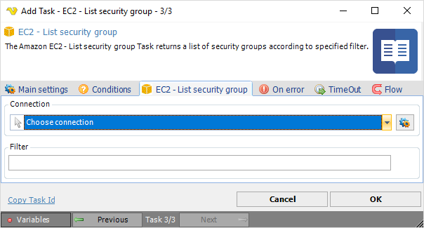

## Task Amazon EC2 - List Security Group

The Amazon EC2 - List security group Task returns a list of security groups according to the specified filter.

**Connection**

To use Amazon EC2 Tasks you need to create a [Connection](../../global-connections) first. Click the *Settings* icon to open the *Manage Connections* dialog.
 
**Filter**

Filter for security groups. 

:::tip Example

`{"Name": "instance-type", "Values": ["t2.micro", "m1.medium"]}`

:::