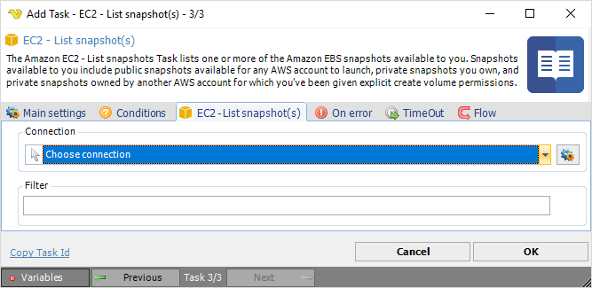

## Task Amazon EC2 - List Snapshot

The Amazon EC2 - List snapshots Task lists one or more of the Amazon EBS snapshots available to you. Snapshots available to you include public snapshots available for any AWS account to launch, private snapshots you own and private snapshots owned by another AWS account for which you've been given explicit create volume permissions.

**Connection**

To use Amazon EC2 Tasks you need to create a [Connection](../../global-connections) first. Click the *Settings* icon to open the *Manage Connections* dialog.
 
**Filter**

Filter for snapshots. 

:::tip Example: 

`{"Name": "instance-type", "Values": ["t2.micro", "m1.medium"]}`
 
:::
