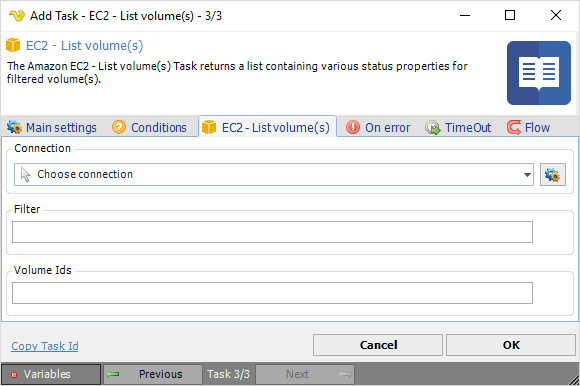

## Task Amazon EC2 - List Volume

The Amazon EC2 - List volume(s) Task returns a list containing various status properties for filtered volume(s).

**Connection**

To use Amazon EC2 Tasks you need to create a [Connection](../../global-connections) first. Click the *Settings* icon to open the *Manage Connections* dialog.
 
**Filter**

Filter for volumes. 

:::tip Example: 

`{"Name": "instance-type", "Values": ["t2.micro", "m1.medium"]}`
 
:::

**Volume IDs**

The ID of the volume to list.