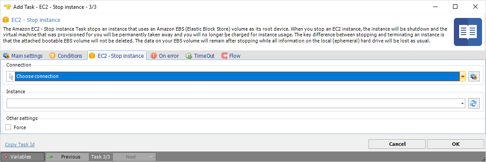

## Task Amazon EC2 - Stop Instance

The Amazon EC2 - Stop instance Task stops an instance that uses an Amazon EBS (Elastic Block Store) volume as its root device. When you stop an EC2 instance, the instance will be shutdown and the virtual machine that was provisioned for you will be permanently taken away and you will no longer be charged for the instance usage. The key difference between stopping and terminating an instance is that the attached bootable EBS volume will not be deleted. The data on your EBS volume will remain after stopping while all information on the local (ephemeral) hard drive will be lost as usual.

**Connection**

To use Amazon EC2 Tasks you need to create a [Connection](../../global-connections) first. Click the *Settings* icon to open the *Manage Connections* dialog.
 
**Instance**

The instance ID to start. Click the *Refresh* icon to populate the drop-down instance ID list.
 
**Force**

If checked, the instance will be forced to stop. This may cause file system problems and is not recommended for Windows instances.