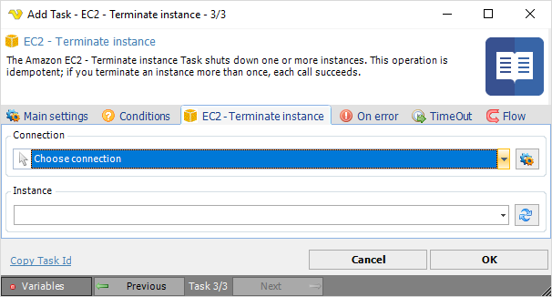

## Task Amazon EC2 - Terminate Instance

**Connection**

To use Amazon EC2 Tasks you need to create a [Connection](../../global-connections) first. Click the *Settings* icon to open the *Manage Connections* dialog.
 
**Instance**

The instance ID to start. Click the *Refresh* icon to populate the drop-down instance ID list.