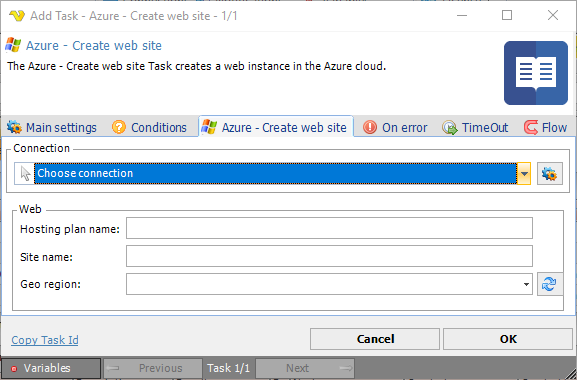

## Task Azure - Create Web Site

The Azure - Create Web Site Task creates a web instance in the Azure cloud. This Task is using the [Microsoft Azure Connection](../../connection-microsoft-azure).
 
**Azure - Cleate web site** tab

**Connection**

To use the Azure Tasks you need to create a [Connection](../../global-connections) first. Click the *Settings* icon to open the *Manage Connections* dialog.
 
**Web**

Enter web site information. Click the *Refresh* icon to populate the *Geo region* drop-down list.