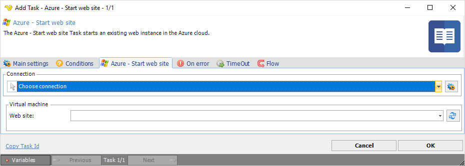

## Task Azure - Start Web Site

The Azure - Start Web Site Task starts an existing web instance in the Azure cloud.  This Task is using the [Microsoft Azure Connection](../../connection-microsoft-azure).
 
**Azure - Start web site** tab

**Connection**

To use the Azure Tasks you need to create a [Connection](../../global-connections) first. Click the *Settings* icon to open the *Manage Connections* dialog.
 
**Web site**

The Azure web instance name. Click the *Refresh* icon to populate the drop-down list.

