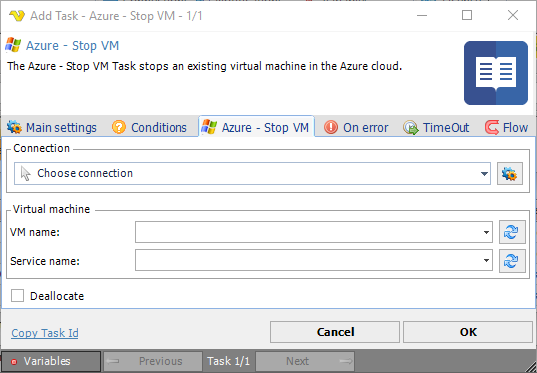

## Task Azure - Stop VM

The Azure - Stop VM Task stops an existing virtual machine in the Azure cloud. This Task is using the [Microsoft Azure Connection](../../connection-microsoft-azure).
 
**Azure - Stop VM** tab

**Connection**

To use the Azure Tasks you need to create a [Connection](../../global-connections) first. Click the *Settings* icon to open the *Manage Connections* dialog.
 
**VM name**

The Azure virtual machine name. Click the *Refresh* icon to populate the drop-down VM name list.
 
**Service name**

The Azure service name. Click the *Refresh* icon to populate the drop-down service name list.
 
**Deallocate**

In the stopped (deallocated) state, there is no continues to bill for resources.