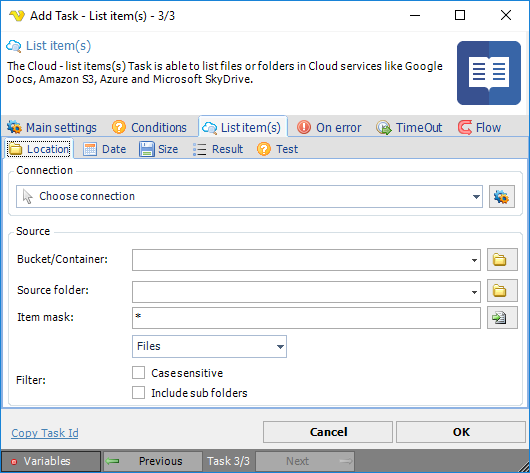

## Task Cloud Transfer - List Item

The Cloud - List item(s) Task is able to list files or folders in Cloud services like Amazon S3, Box, Dropbox, Google Drive, Microsoft Azure and OneDrive.

This Task uses the [Cloud Remote file filter](../../job-tasks-cloud-remote-file-filter) for settings.