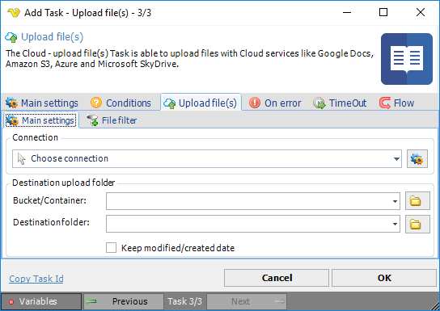

## Task Cloud Transfer - Upload File

The Cloud - Upload file(s) Task let's you upload files to a cloud service like Amazon S3, Box, Dropbox, Google Drive, Microsoft Azure and OneDrive.
 
**Upload file(s) > Main settings** sub tab

**Connection**

To use a specific cloud service you need to create a [Connection](../../global-connections) first. Click the Settings icon to open the Manage Connections dialog.
 
**Bucket/Container**

This property refers to "Container" in Windows Azure and "Bucket" in Amazon S3. For other cloud services this property is disabled. Click the *Folder* icon to list all available Buckets/Containers.
 
**Destination folder**

This is destination folder in the cloud - where the files should be uploaded to. Click the *Folder* icon to list folders from the cloud.
 
**Keep modified/created date**

If checked don't change the modified/created date of the file.
 
**Upload file(s) > File filter > Location** sub tab

This Task uses the standard VisualCron [File filter](../../job-tasks-file-filter) to define the properties of the listed files.