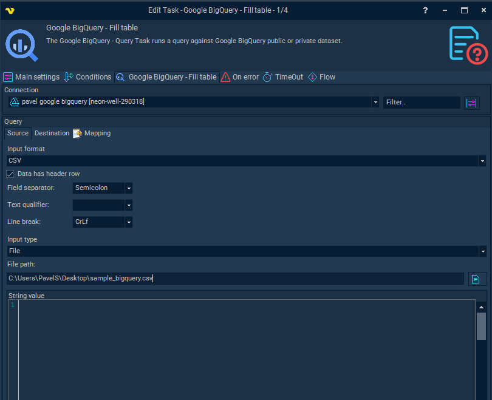
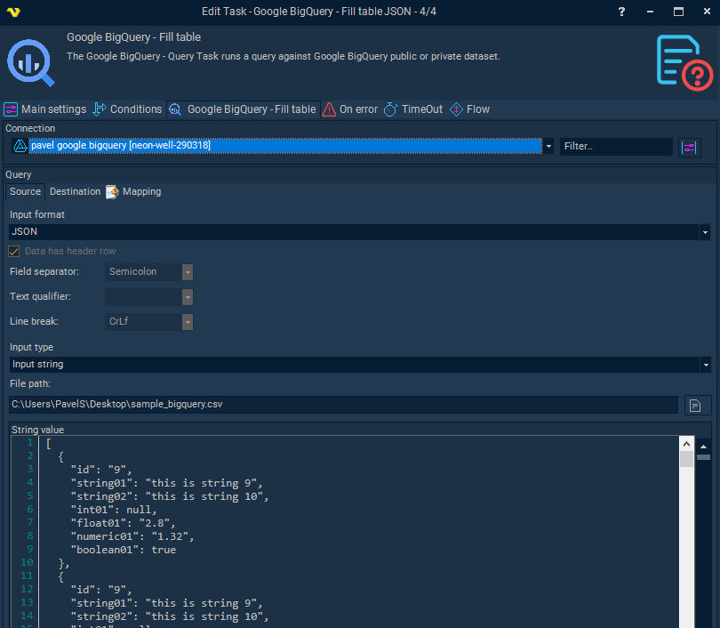

## Task Database - BigQuery - Fill Table

The Google BigQuery - Fill Task loads data into Google BigQuery private dataset table.
 
The BigQuery Tasks require the [Google Cloud Connection](../../../server/connection-google-cloud).

*Connection**

Select the Google Cloud Connection to use for this Task.

**Source** tab

**Input type**

Select *File* to read input data from a file on disk, or *Input string* to provide data directly as a string value. Both support Variables.

**File path**

The full path to the input file. Only active when *Input type* is set to *File*. Click the browse button to select a file.

**String value**

The data to load into BigQuery. Only active when *Input type* is set to *Input string*.

**Input format**

Select *CSV* or *JSON*. When *CSV* is selected the following CSV-specific settings become active.
 
**Data has header row**

When checked, the first line of the input is treated as a header row containing column names. Column name mapping will be used. When unchecked, positional mapping is applied instead.
 
**Field separator**

The character that separates fields within a single line of CSV input.

**Text qualifier**

The character used to quote text fields in the CSV input. The qualifier character is stripped from the start and end of each text field value.

**Line break**

The character or sequence used as a line break between rows in the CSV input.
 
**When input format is JSON**

A valid JSON array of JSON objects is expected as input. Column mapping is performed using the JSON object property names.

**Destination** tab

**Project**

The Google Cloud project containing the target dataset. Click the dropdown to select from available projects.

**Dataset**

The BigQuery dataset containing the target table. Click *Refresh* to populate the list from the selected project.

**Table**

The BigQuery table to load data into. Click *Refresh* to populate the list from the selected dataset.

**Mapping** tab

The mapping grid defines how source columns or JSON properties map to destination BigQuery table columns. Columns shown are: Source Column, Position, Destination Column, Data type, and Mode.

Click *Refresh mapping* to populate the grid from the selected destination table. Use *Add*, *Edit*, and *Delete* to manage mapping entries manually.

When adding or editing a mapping entry:

**Source column name**

The name of the column or JSON property in the source data.

**Source column position**

The positional index of the column in the source data (used when there is no header row).

**Destination column name**

The column in the BigQuery table to map to. Select from the list populated by the destination table schema.

**Data type**

Read-only. Displays the BigQuery data type of the selected destination column.

**Column mode**

Read-only. Displays the mode of the selected destination column: NULLABLE, REQUIRED, or REPEATED.
