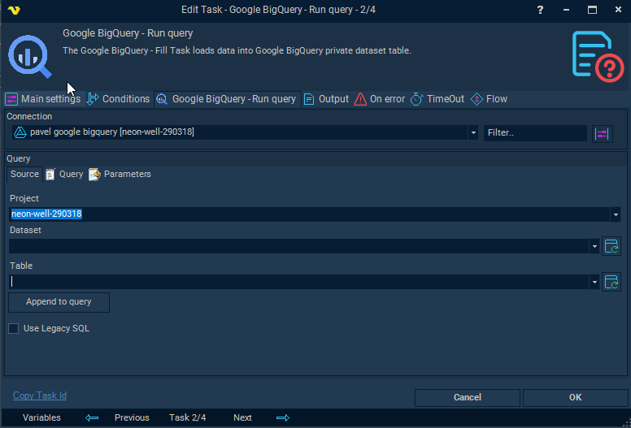

## Task Database - BigQuery - Run Query

The Google BigQuery - Query Task runs a query against Google BigQuery public or private dataset.
 
The BigQuery Tasks require the [Google Cloud Connection](../../../server/connection-google-cloud).

**Connection**

Select the Google Cloud Connection to use for this Task.

**Source** tab



The Source tab is a browser for exploring projects, datasets, and tables. Use it to locate a specific table and append a starter query to the Query tab. The Dataset and Table selections on this tab are not saved when the Task saves.

**Project**

The project name from the selected connection, or `bigquery-public-data` to browse publicly available datasets.

**Dataset**

Datasets within the selected project. Click *Refresh* to populate the list.

**Table**

Tables within the selected dataset. Click *Refresh* to populate the list.
 
:::info Note 

Dataset and Table fields are not saved when Task saves

:::

**Append to query**

When clicked, generates an initial SELECT query using the selected Project, Dataset, and Table and appends it to the Query tab:

```SELECT * FROM `project.dataset.table` LIMIT 1000```

**Use Legacy SQL**

When checked, Legacy SQL mode is used when executing the query. When unchecked (default), Standard SQL is applied.

**Query** tab

Enter the SQL query to run against BigQuery. The editor supports SQL syntax highlighting. Standard SQL is used by default; enable *Use Legacy SQL* on the Source tab to switch modes.

**Parameters** tab

**Parameters type**

Select *Named parameters* to reference parameters by name in the query (e.g. `@name`), or *Position parameters* to reference them by position (e.g. `?`).

The grid lists all defined parameters with columns: Name, Data type, Item data type, Value, and Is Null. Use the *Add*, *Edit*, and *Delete* buttons to manage parameters.

When adding or editing a parameter:

**Name**

The parameter name, referenced in the query using the `@name` syntax when using named parameters.

**Data type**

The BigQuery data type of the parameter. Supported types are: Array, Bool, Bytes, Date, DateTime, Float64, Geography, Int64, Numeric, String, Struct, Time, and Timestamp.

**Item data type**

The data type of each element within an Array parameter. Only active when *Data type* is set to *Array*.

**Value**

The value to pass for the parameter. Supports Variables.

**Use null value**

When checked, the parameter is passed as NULL regardless of the Value field.
