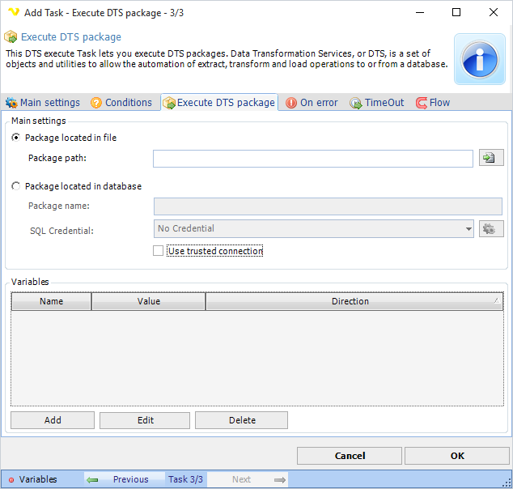

## Task Database - Execute DTS Package

This Task lets you execute local DTS packages. VisualCron must reside on the server machine to be able to execute this Task. To execute remote DTS packages you can use the SQL Task and type Job.
 
**Execute DTS package** tab

**Package located in file**

Specify the full path to the file.
 
**Package located in database**

If the package is located in the database then you specify the package name here.
 
**SQL Credential**

When using a *Trusted connection* this should be a Windows user that have access to the SQL server. Use Load profile option in the Credential. The domain name must be the DNS name or IP of the SQL server. Click the *Settings* icon to open the *Manage credentials* dialog.
 
When not using a *Trusted connection* this should be the username and password of the SQL Server. The domain name must be the DNS name or IP of the SQL server.
 
**Use trusted connection**

Check this if you want to impersonate as a Windows user to access database instead of using SQL Server credentials.
 
**Variables**

If the package needs variables you enter them here by clicking on Add.